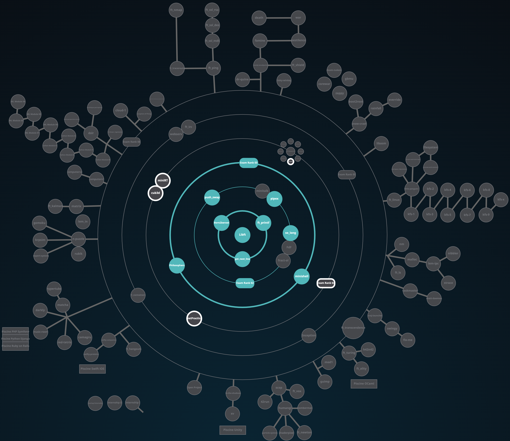

# 1337 - 42 NETWORK

## HolyGraph

## INFO
***CLASS OF 01/11/2021 (4th promo)***

## PROJECTS

### COMMON CORE
(***! to see the subjects click on the status***)

(***! some projects can't be uploaded due to there nature (virtual machine - networking - ...)***)

(***! some projects only has 100 as max score***)

(***! plz use the evaluation pdfs as reference only since they change with time***)

| CIRCLE  | NAME | FIELD | EXPECTED DURATION | EXP | STATUS | LVL |
| :-: | :-: | :-: | :-: | :-: | :-: | :-: |
| 0 | [libft](./LVL0/libft) | C | 70 hours | 462 |  | 1.05 |
| 1 | [get next line](./LVL1/get_next_line) | C | 70 hours | 882 |  | 1.54 |
| 1 | [ft_printf](./LVL1/ft_printf) | C | 175 hours | 882 |  | 2.02 |
| 1 | Born2beRoot | Virtual Machine | 40 hours | 577 |  | 2.25 |
| 2 | [push_swap](./LVL2/push_swap) | C | 60 hours | 1855 |  | 2.97 |
| 2 | [so_long](./LVL2/so_long) | C | 60 hours | 1000 |  | 3.20 |
| 2 | [pipex](./LVL2/pipex) | C | 50 hours | 1142 |  | 3.44 |
| 3 | [philosophers](./LVL3/philosophers) | C | 70 hours | 3360 |  | - |
| 3 | [minishell](./LVL3/minishell) | C | 210 hours | 2814 |  | - |
