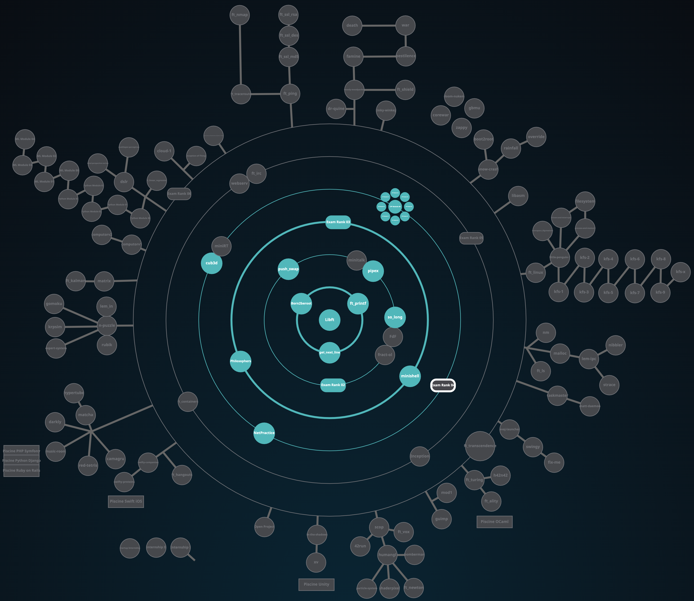

# 1337 - 42 NETWORK

## HolyGraph

## INFO

**_CLASS OF 01/11/2021 (4th promo)_**

## PROJECTS

### COMMON CORE

> :bulb: **_! to see the subjects click on the `status`_**

> :warning: **_! some projects can't be uploaded due to there nature [virtual machine - networking - ... ]_**

> :warning: **_! some projects only has `100` as max score_**

> :warning: **_! please use the `evaluation pdfs` as reference only since they are bound change with time_**

<h5>CIRCLE 0</h5>

|                 NAME                  |      FIELD      | EXPECTED DURATION |  EXP |                                                                   STATUS                                                                    | LVL  |
| :-----------------------------------: | :-------------: | :---------------: | :--: | :-----------------------------------------------------------------------------------------------------------------------------------------: | :--: |
|         [libft](./LVL0/libft)         |        C        |     70 hours      | 462  |                  | 1.05 |

<h5>CIRCLE 1</h5>

|                 NAME                  |      FIELD      | EXPECTED DURATION | EXP  |                                                                   STATUS                                                                    | LVL  |
| :-----------------------------------: | :-------------: | :---------------: | :--: | :-----------------------------------------------------------------------------------------------------------------------------------------: | :--: |
| [get next line](./LVL1/get_next_line) |        C        |     70 hours      | 882  |  | 1.54 |
|     [ft_printf](./LVL1/ft_printf)     |        C        |     175 hours     | 882  |          | 2.02 |
|              Born2beRoot              | Virtual Machine |     40 hours      | 577  |      | 2.25 |

<h5>CIRCLE 2</h5>

|                 NAME                  |      FIELD      | EXPECTED DURATION | EXP  |                                                                   STATUS                                                                    | LVL  |
| :-----------------------------------: | :-------------: | :---------------: | :--: | :-----------------------------------------------------------------------------------------------------------------------------------------: | :--: |
|     [push_swap](./LVL2/push_swap)     |        C        |     60 hours      | 1855 |          | 2.97 |
|       [so_long](./LVL2/so_long)       |     C - mlx     |     60 hours      | 1000 |              | 3.20 |
|         [pipex](./LVL2/pipex)         |        C        |     50 hours      | 1142 |                  | 3.44 |

<h5>CIRCLE 3</h5>

|                 NAME                  |      FIELD      | EXPECTED DURATION | EXP  |                                                                   STATUS                                                                    | LVL  |
| :-----------------------------------: | :-------------: | :---------------: | :--: | :-----------------------------------------------------------------------------------------------------------------------------------------: | :--: |
|  [philosophers](./LVL3/philosophers)  |        C        |     70 hours      | 3360 |           | 4.05 |
|     [minishell](./LVL3/minishell)     |        C        |     210 hours     | 2814 |          | 4.25 |

> :bulb: **`MiniShell`** team with [**`@izouf`**](https://github.com/izouf)

<h5>CIRCLE 4</h5>

|                 NAME                  |      FIELD      | EXPECTED DURATION | EXP  |                                                                   STATUS                                                                    | LVL  |
| :-----------------------------------: | :-------------: | :---------------: | :--: | :-----------------------------------------------------------------------------------------------------------------------------------------: | :--: |
|              NetPractice              |   Networking    |     50 hours      | 3160 |     | 4.43 |
|         [cub3D](./LVL4/cub3d)         |     C - mlx     |     280 hours     | 5775 |                  | 4.84 |
|       [CPP](./LVL4/CPP%20pool)        |       CPP       |  ( 7 x 9 ) hours  | 9660 |                   | 5.41 |

> :bulb: **`Cub3D`** team with [**`@ojamil`**](https://github.com/oussamajamil) (first time)
> :bulb: **`Cub3D`** team with [**`@ylabtaim`**](https://github.com/youcef-s) (second time)

<h5>CIRCLE 5</h5>

|                 NAME                  |      FIELD      | EXPECTED DURATION |  EXP  |                                                                   STATUS                                                                    | LVL  |
| :-----------------------------------: | :-------------: | :---------------: | :--:  | :-----------------------------------------------------------------------------------------------------------------------------------------: | :--: |
| [ft_containers](./LVL5/ft_containers) |       CPP       |     140 hours     | 10042 |  | 6.17 |

